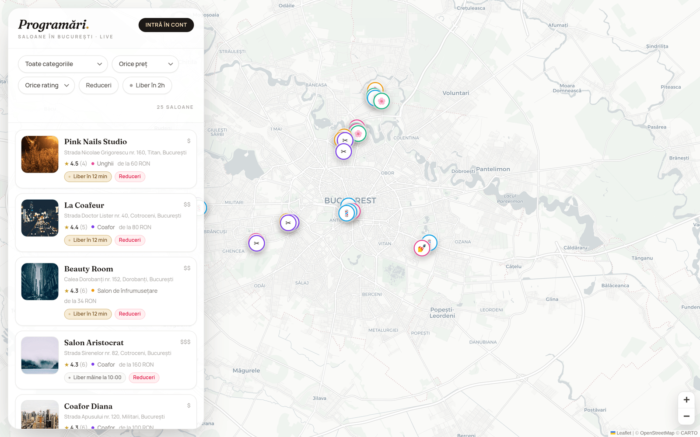
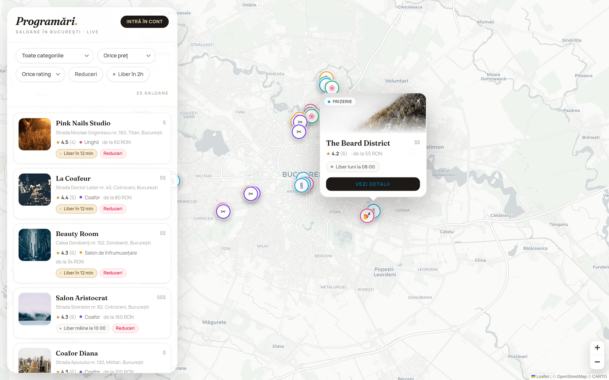
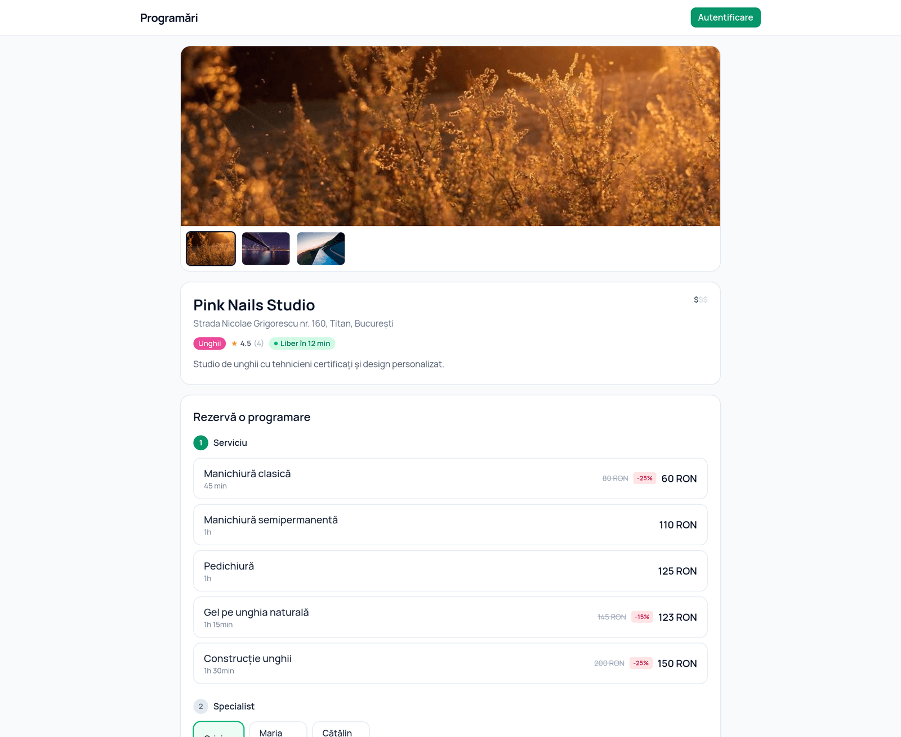
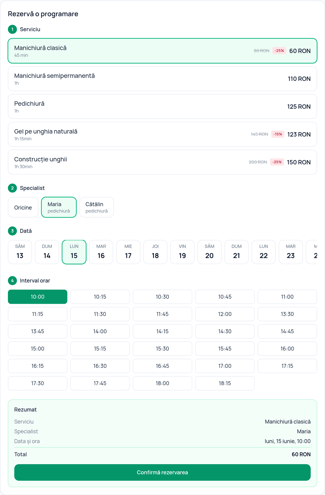
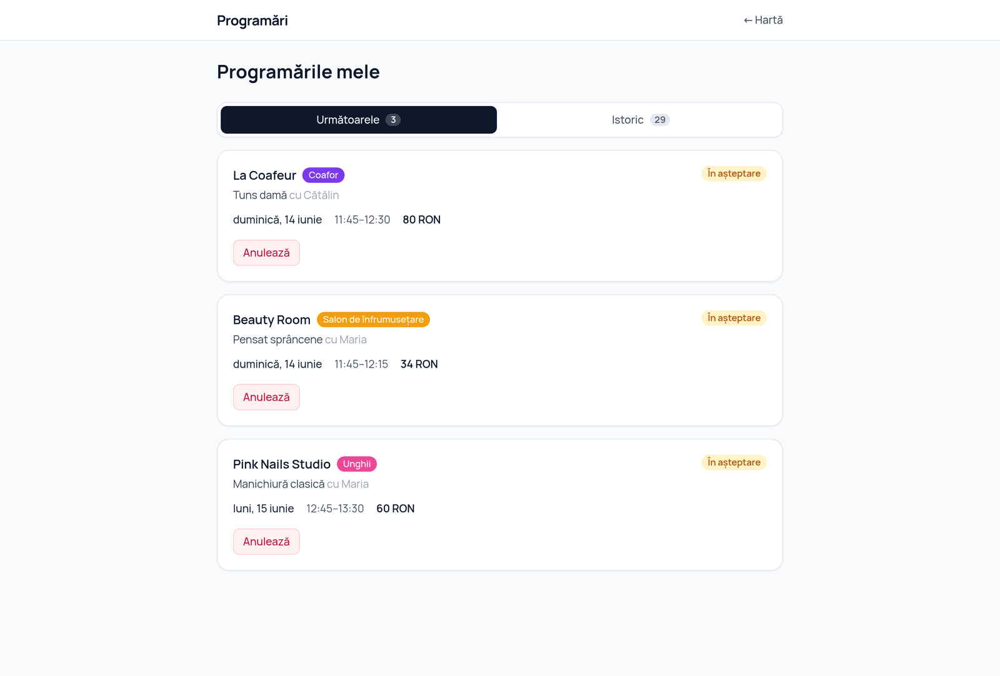
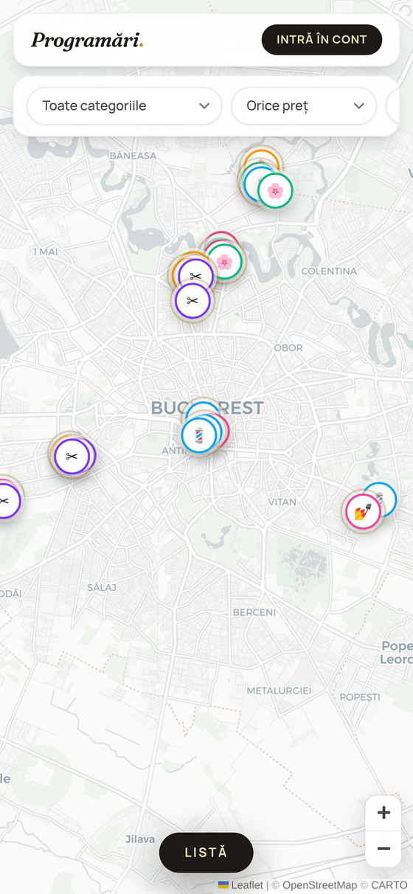
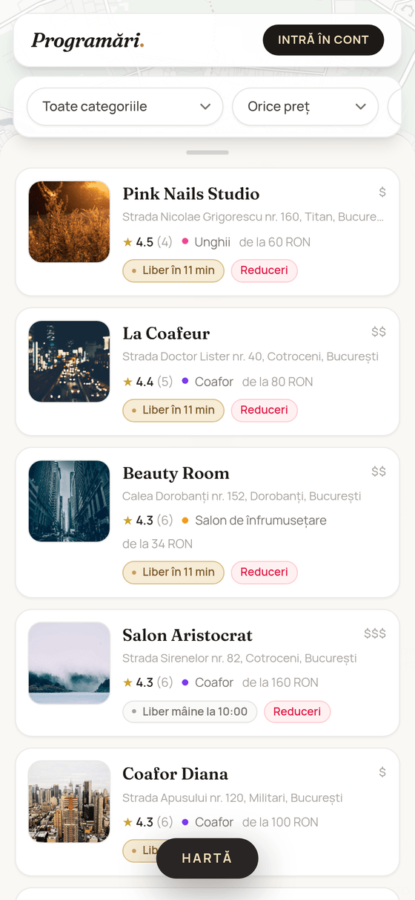

<div align="center">

# Programări

### A map-first booking platform for beauty services in Bucharest — with a real-time availability engine.

*Find saloane, frizerii, unghii, barbershops & spa near you on a live map, see who's free, and book in seconds.*


</div>

<br />

<p align="center">
  
</p>

> **The killer feature — _„liber în 2h lângă tine”_.** Every salon's *next available slot* is computed live and shown on the map. Toggle **„Liber în 2h”** and the markers instantly narrow to places you can walk into within the next two hours — like watching nearby drivers on a ride-hailing app, but for an empty chair at the salon.

---

## ✨ Highlights

- 🗺️ **Map-first discovery** — full-screen Leaflet map of Bucharest with custom per-category markers, a glowing halo on salons free within 2h, and rich photo popups.
- ⚡ **Real-time availability** — a purpose-built engine intersects working hours, staff schedules, service duration and existing bookings to produce bookable 15-minute slots.
- 📅 **Frictionless booking** — pick a service → a specialist (or *„Oricine”*) → a day → a slot, with the discounted total shown before you confirm. Browsing is anonymous; you only sign in at the confirm step.
- 🔒 **Correct under concurrency** — booking is transactional with conflict detection, so a double-booking is impossible even when two people race for the same slot.
- 🇷🇴 **Romanian throughout** — `ro-RO` dates and currency, Europe/Bucharest timezone, prices in RON.
- 📱 **Mobile-first & responsive** — a floating glass results panel on desktop, a bottom-sheet list + map/list toggle on mobile.

---

## 📸 A look around

### Discover on the map
Custom markers colored by category, a champagne halo on places free within 2h, and an editorial popup with photo, rating, next slot and a direct link.

<p align="center">
  
</p>

### Salon page & booking flow
Photo gallery, services with live discounts, staff and working hours — and a guided booking stepper that fetches real availability for the chosen day.

<table>
  <tr>
    <td width="50%"></td>
    <td width="50%"></td>
  </tr>
</table>

### Your appointments
Upcoming and past bookings, with cancellation allowed up to 2 hours before the start.

<p align="center">
  
</p>

### On mobile
<table>
  <tr>
    <td width="50%" align="center"></td>
    <td width="50%" align="center"></td>
  </tr>
</table>

---

## 🧠 The heart: the availability engine

This is the part that makes the product work, so it's built to be **deterministic and thoroughly tested**. The engine lives in [`src/lib/availability/`](src/lib/availability/), split into four deliberately separated layers — with booking *policy* (the cancellation window and `„Oricine”` selection) alongside it in [`booking-rules.ts`](src/lib/booking-rules.ts), kept just as pure and testable:

| Layer | File | Responsibility |
| --- | --- | --- |
| **Pure slot core** | `slots.ts` | Computes bookable slots in a *minutes-from-midnight* domain — no DB, no timezone. 15-minute granularity; a slot is valid only if the full service duration fits before closing **and** at least one staff member is free. Fully deterministic → fully testable. |
| **Timezone boundary** | `time.ts` | The *single* place UTC ↔ Europe/Bucharest conversion happens (DST-aware). |
| **Engine** | `engine.ts` | Bridges persisted rows into the pure core, hides past slots for *today*, and computes each salon's **next available slot** for the map. |
| **Booking** | `booking.ts` | Transactional creation with layered conflict detection (see below). |

### Why a double-booking can't happen

Booking safety is layered so it holds even on Postgres under real concurrency:

1. The transaction runs at **Serializable** isolation (provider-aware — applied on Postgres/MySQL, where it matters; SQLite already serializes writes) and **retries** transparently on a serialization failure.
2. Inside it, an **overlap check** rejects any blocking appointment intersecting the requested span for that staff member — this catches overlaps the index can't.
3. A **`@@unique([staffMemberId, startTime])`** constraint is the hard backstop for the identical-start race.

The result: of two concurrent requests for the same slot, **exactly one** succeeds — the other gets a clean `409`. If a `„Oricine”` request loses the race, the server automatically retries onto another free specialist instead of failing.

> The server is **authoritative on availability** — it recomputes the day's slots on every booking request and refuses a start time the client may have tampered with.

---

## 🏗️ Architecture

```
Browser (client components: MapView, BookingFlow, FilterBar, …)
        │  fetch() JSON
        ▼
API routes  (src/app/api/**)  ──  Zod validation · NextAuth session gate · typed { error: { code, message } }
        │
        ▼
Domain services (src/lib)     ──  salons.ts · appointments.ts · auth.ts
        │
        ▼
Availability engine (src/lib/availability)  ←  the heart, pure where it matters
        │
        ▼
Prisma client → SQLite (dev)  ·  Postgres-compatible schema for production
```

**Three invariants the codebase holds to:**
1. All slot computation flows through `src/lib/availability`; booking policy (cancellation window, `„Oricine”` selection) lives in dedicated, equally pure modules — never inlined into routes or components.
2. The server is authoritative on availability; a tampered request can't double-book.
3. Timestamps are UTC in the DB; the only timezone boundary is `time.ts` (+ `format.ts` for display).

<details>
<summary><strong>Project structure</strong></summary>

```
src/
  app/
    page.tsx                     # map discovery home
    salon/[id]/page.tsx          # salon detail + booking
    appointments/page.tsx        # client dashboard (auth-gated)
    login/page.tsx               # sign in / register
    api/
      salons/…                   # list (+ next slot) · detail · availability
      appointments/…             # create · list · cancel
      auth/…                     # NextAuth + register
  components/                    # MapView, BookingFlow, FilterBar, SalonCard, …
  lib/
    availability/                # slots · time · engine · booking (+ tests)
    salons.ts · appointments.ts  # data-access services
    booking-rules.ts             # cancellation window · „Oricine” selection (pure)
    auth.ts · validation.ts · dto.ts · enums.ts · format.ts
prisma/
  schema.prisma                  # Postgres-compatible schema (SQLite in dev)
  seed.ts                        # 25 realistic Bucharest salons + demo accounts
```
</details>

---

## 🛠️ Tech stack

- **Next.js 14** (App Router, TypeScript **strict**, no `any`) — frontend + API in one repo
- **Prisma + SQLite** in dev; the schema is kept **Postgres-compatible** for production
- **react-leaflet + OpenStreetMap / CARTO** tiles — no map API key required
- **NextAuth.js** (credentials) — JWT sessions carrying user id + role
- **Zod** validation on every API input · **Tailwind CSS** mobile-first
- **Vitest** — 39 tests across the availability engine and booking rules

No paid APIs, no external keys: everything runs locally with `npm run dev`.

---

## 🌐 API

| Method | Route | Notes |
| --- | --- | --- |
| `GET` | `/api/salons?category=&maxPrice=&minRating=&discount=&within2h=` | List salons with each one's computed `nextSlot` |
| `GET` | `/api/salons/:id` | Full salon detail |
| `GET` | `/api/salons/:id/availability?serviceId=&date=` | Bookable slots for a day |
| `POST` | `/api/appointments` | Create a booking *(auth required)* |
| `GET` | `/api/appointments` | The signed-in user's upcoming & past bookings |
| `POST` | `/api/appointments/:id/cancel` | Cancel — allowed up to 2h before start |
| `POST` | `/api/auth/register` | Create a client account |

Every input is validated with Zod; errors return a typed `{ error: { code, message } }` envelope.

---

## 🚀 Getting started

```bash
npm install
npx prisma migrate dev      # create the SQLite DB and apply migrations
npx prisma db seed          # 25 Bucharest salons + demo accounts
npm run dev                 # http://localhost:3000
```

Run the test suite:

```bash
npm run test                # 39 Vitest tests
```

### Demo accounts (seeded)

| Role | Email | Password |
| --- | --- | --- |
| Client | `client@demo.ro` | `demo1234` |
| Salon owner | `owner@demo.ro` | `demo1234` |

### Environment

`.env` ships with safe local-dev defaults (`DATABASE_URL="file:./dev.db"`, a placeholder `NEXTAUTH_SECRET`). No keys needed — OpenStreetMap/CARTO tiles are free. In production the app refuses to boot with the placeholder secret; see [`.env.example`](.env.example).

---

## ✅ Testing

`npm run test` runs **39 Vitest tests** over the parts that must be correct:

- **Slot computation** — the 15-minute grid, edge-of-closing-time fits, overlapping bookings, per-staff availability.
- **Engine** — timezone correctness (UTC ↔ Bucharest), hiding past slots, next-available rollover, cancelled appointments freeing slots.
- **Booking** — the double-booking race (exactly one of two wins), Serializable retry on serialization failure, conflict mapping.
- **Rules** — the 2-hour cancellation window and `„Oricine”` staff selection.

---

## 🗺️ Roadmap

- [x] **Phase 1 — Discovery:** map home, filters, salon detail, availability engine + tests
- [x] **Phase 2 — Booking:** auth, booking flow, client dashboard, transactional bookings
- [ ] **Phase 3 — Salon owner:** owner dashboard (today's timeline, manage services & hours, stats)
- [ ] **Phase 4 — Polish:** review submission + rating recompute, loading/empty/error states

---

<div align="center">
<sub>Built with Next.js · Prisma · Leaflet — a portfolio project demonstrating a correct, real-time availability engine behind a polished map-first UI.</sub>
</div>
